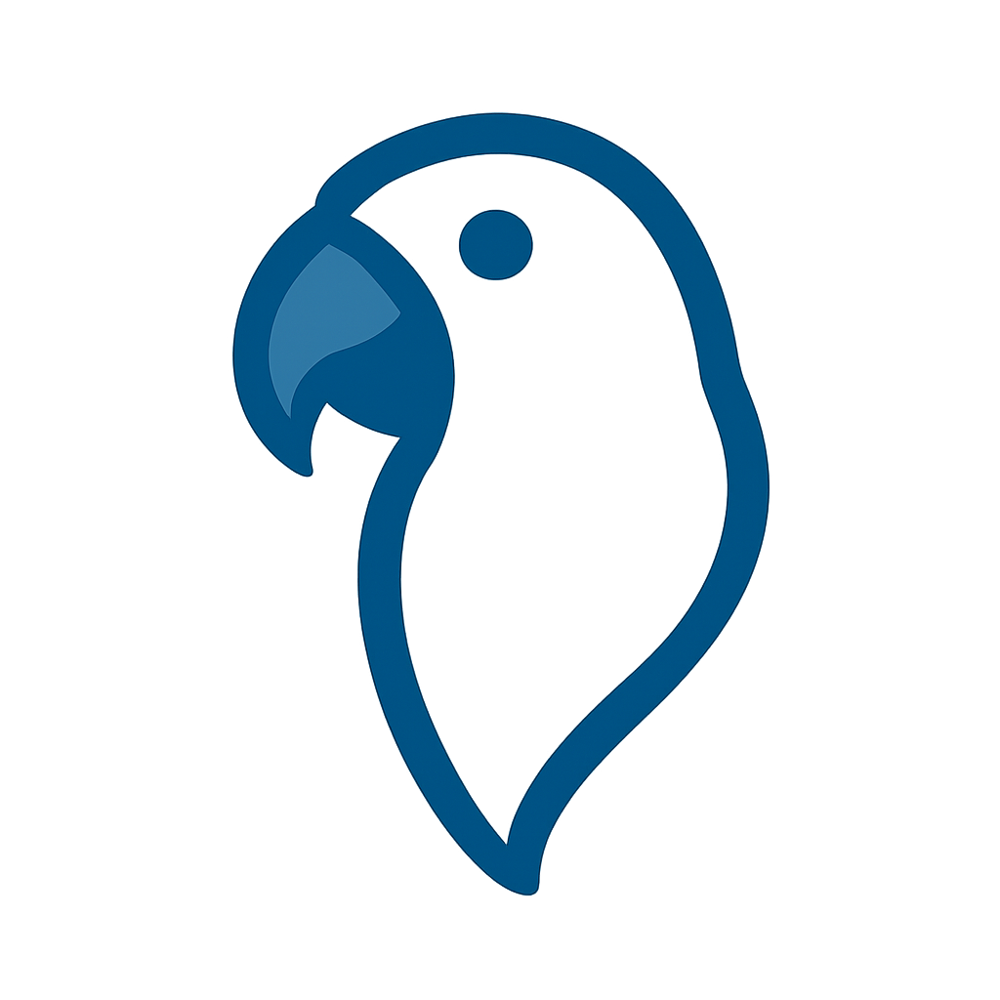

# cli_chat

Open source cross-platform chatting application. 

## Dependencies

The application uses the following libraries:
- [boost-asio](https://www.boost.org/doc/libs/1_89_0/doc/html/boost_asio.html)
- [CLI11](https://github.com/CLIUtils/CLI11)
- [imgui](https://github.com/ocornut/imgui)
- [nlohmann-json](https://github.com/nlohmann/json)
- [SDL2](https://www.libsdl.org/)
- [spdlog](https://github.com/gabime/spdlog)

## Build from source
First add all the necessary submodules with
```
git submodule update --init --recursive
```

After that, just
```
cmake -S . -B build -DBUILD_CLIENT:BOOL=ON -DBUILD_SERVER:BOOL=ON
cmake --build build
```

